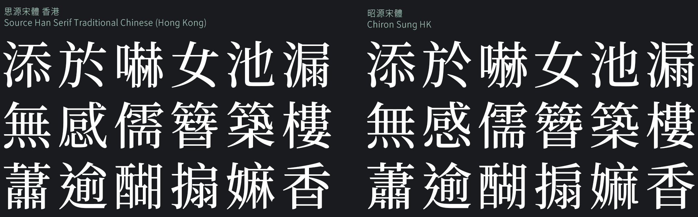
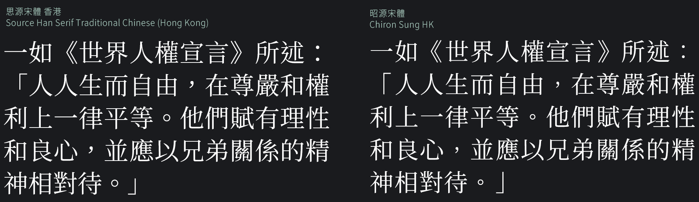
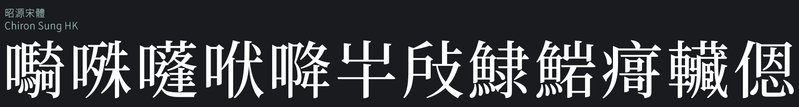
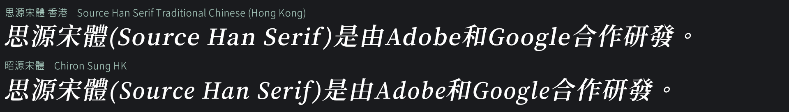
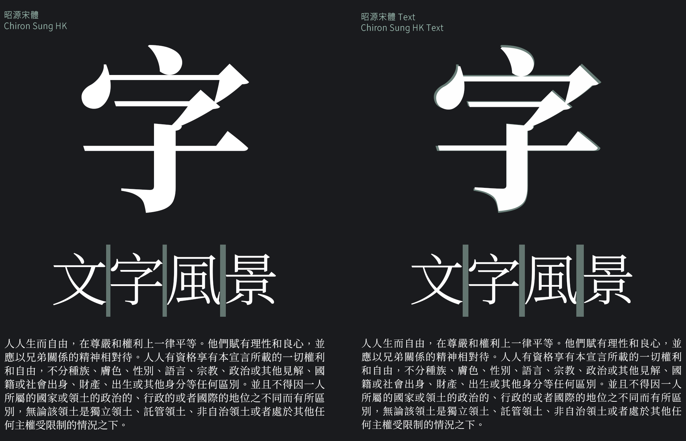

Chiron Sung HK: a typeface for Traditional Chinese users
=======================

[中文版説明請按此 / Click here for the Chinese README](README.md)

Chiron Sung HK (昭源宋體) is a Traditional Chinese serif typeface based on [Adobe](https://adobe.com/)’s [Source Han Serif](https://github.com/adobe-fonts/source-han-serif) (a.k.a. [Google](https://www.google.com)’s [Noto Sans CJK](https://github.com/googlefonts/noto-cjk/)). The font aims at providing a modern, region-agnostic glyph set adopting the “modern” glyph style that is similar to the prevailing, usually commercial, typefaces in the Traditional Chinese regions.

Also check out [Chiron Hei HK](https://github.com/chiron-fonts/chiron-hei-hk/), the complementary sans-serif typeface for Chiron Sung HK.

*Note: as this font targets Traditional Chinese users, the [website](https://chiron-fonts.github.io/) and the [CHANGELOG](CHANGELOG.md) details are available in Traditional Chinese only.* 

## Usage

### For desktop

Download the font from the [Github Releases](https://github.com/chiron-fonts/chiron-sung-hk/releases/latest) page and install. The font comes with TrueType (`TTF/` directory), OpenType (`OTF/` directory), Variable TrueType and OpenType (`VAR/` directory) formats, together with a webfont (`WEBFONT/` directory) version in WOFF2 format for web use.

The font family name is *Chiron Sung HK* for static instances, and *Chiron Sung HK VF* for the variable font configuration.

### For web

In addition to downloading manually through the Github Release page, there are two more ways to access the webfont version of Chiron Sung HK.

1. Self-host the webfont version by installing the corresponding [npm package](https://www.npmjs.com/package/chiron-sung-hk-webfont) and import the CSS files. For example: 

```css
@import '~chiron-sung-hk-webfont/css/vf.css';
@import '~chiron-sung-hk-webfont/css/vf-italic.css';
```

2. Access the webfont via CDN. Go to the [jsDeliver](https://www.jsdelivr.com/package/npm/chiron-sung-hk-webfont?path=css) webpage, add the desired font styles to the collection, and retrieve the CSS import statements. *Note: do not use the option that merges all the selected styles into a single file. This will not work.* 

Usage example:

```css
body {
    font-family: "Chiron Sung HK WS"; /* Note the font name. */
    font-weight: 310; /* Any number between 250 and 900. */
    font-style: normal; /* normal or italic. */
    font-variation-settings: "PADG" 4; /* Any number between 0 and 10. */
}
```

## Compare to the upstream 



Chiron Sung HK is based on the Traditional Chinese (Hong Kong) variant of Source Han Serif *(the upstream)*. Followings are their comparison to illustrate the features of Chiron Sung HK.

### Glyph shapes

Glyphs of Big Five and HKSCS-2016 character sets for Source Han Serif Traditional Chinese (Hong Kong) are designed in accordance with the [Reference Glyphs for Chinese Computer Systems in Hong Kong
](https://www.ccli.gov.hk/en/download/reference_glyphs.html). In my opinion it is a little too fastidious about asking the printed form of a character to follow how it is written by hand.

Chiron Sung HK takes references from the commercial typefaces commonly seen in Hong Kong, which pays more attention to the overall aesthetics of the glyph shape for printing and display. While Chiron Sung HK does not follow exactly one particular standard (de facto or not), its chosen a glyph form should be considered widely recognized by the Traditional Chinese community.

Over 6,000 glyphs have been remapped or modified. Check out [UpstreamDifferences.pdf](resources/UpstreamDifferences.pdf) for details on the changes.

### `Locl` GSUB feature

Chiron Sung HK covers all codepoints in the **language-specific** configuration of Source Han Serif Traditional Chinese (Hong Kong). However, Chiron Sung HK does not support the `locl` (localized forms) feature of the original typeface. Only the default, opinionated set of glyph shapes will be available. Glyphs that belong to other regions are removed.

### Full-width punctuations adjustment



* Full-width punctuation shapes have been slightly adjusted.
* `‘`, `’`, `“` and `”` now default to their proportional version.      
* Full-width version of `⸺` (U+2E3A) and `⸻` (U+2E3B) are provided by default.
* Removed the `halt` `vhal` `palt` `vpal` Opentype instructions for full-width punctuations. 

### Character additions (Chinese)



Over a thousand Chinese character glyphs have been added. This includes amendments after the publishing of HKSCS-2016, and a lot more.

Again, check out [UpstreamDifferences.pdf](resources/UpstreamDifferences.pdf) for details on this.

### LGC letters

The full set of [Source Serif](https://github.com/adobe-fonts/source-serif) has been incorporated into Chiron Sung HK.

Note that the scaling factor of the LGC characters in Chiron Sung HK is different from the upstream, so it is not a drop-in replacement of the latter. 

### Italic style



Source Han Serif does not have a true italic font configuration. Chiron Sung HK provides an italic style by slanting the original (non-LGC) glyphs and then incorporating the Source Serif italic typeface. 

### Font weight and naming

The static font families, Chiron Sung HK and Chiron Sung HK Text, use abbreviated weight names for better compatibility with certain operating systems. The variable font version (Chiron Sung HK VF) adopts the long weight names as its upstream.

| Chiron Sung HK/HK Text | Chiron Sung HK VF | Weight Axis Value |
|------------------------|-------------------|-------------------|
| EL                     | ExtraLight        | 250               |
| L                      | Light             | 300               |
| N                      | Normal            | 350               |
| R                      | Regular           | 400               |
| M                      | Medium            | 500               |
| SB                     | SemiBold          | 600               |
| B                      | Bold              | 700               |
| H                      | Heavy             | 900               |

Note that the “Normal” font weight is not present in the upstream.

### Additional “PADG” axis (variable font only)

In addition to the original “wght” axis that controls the weight settings in the variable font, Chiron Sung HK adds a new "PADG" axis to offer control over the area ratio decrement of Han/Kanji characters relative to the upstream. This only changes the glyph contour itself, no other measurement data will be affected (imagine adding a padding of certain value to an invisible box surrounding the character glyph).

This can be any integer between 0 and 10. 0 means no decrement, and setting it to 10 will shrink the character size by about 5%. 

### Additional “Text” subfamily



This subfamily is created by converting the variable instance of different weights with `PADG` axis set to 6 to static instances.

By moderately shrinking the Han/Kanji characters, the “Text” subfamily leaves more space between Chinese characters and is more suitable for body text typesetting.

### Glyph optimization for SemiBold instance

SemiBold master has been added to a small number of frequently accessed characters.

## License

Chiron Sung HK is available under the OFL-1.1 License and can be used free of charge, for both commercial and non-commercial purposes. Refer to  [LICENSE.md](LICENSE.md) for details.

## Donation

Buy me a drink through [Paypal.me](https://www.paypal.com/paypalme/tamcyhk) if you are satisfied with my work.