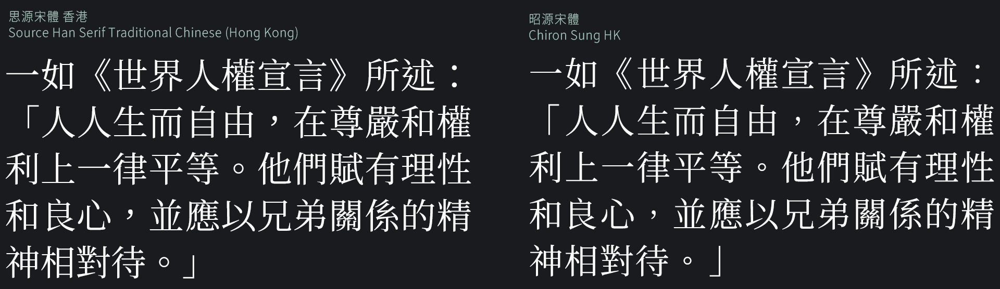
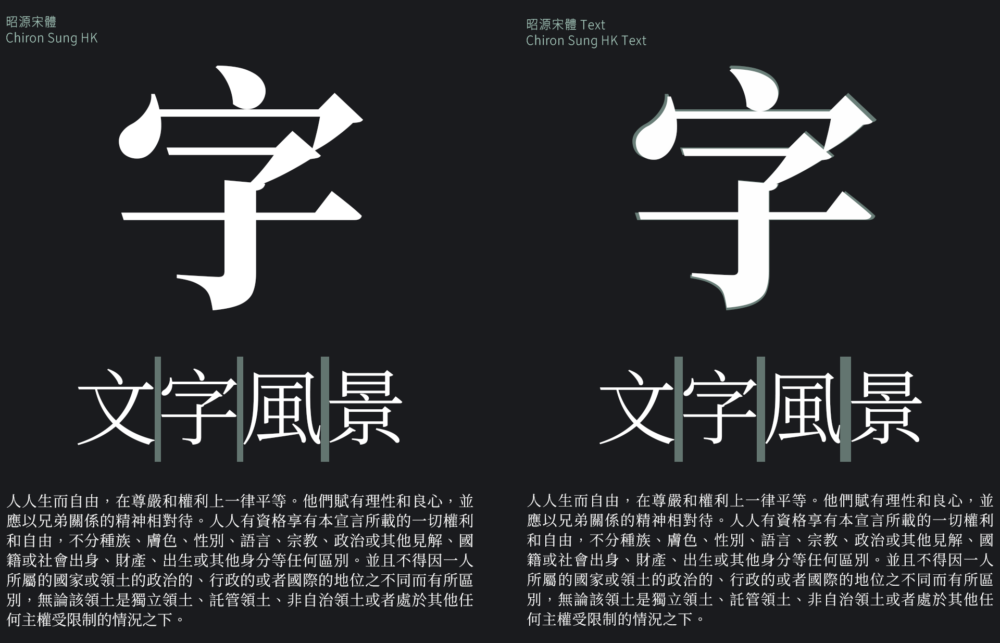

昭源宋體：適合正體中文用戶使用的免費字體
=======================

*[Click here for the English README / 英文版說明](README.en.md)*

昭源宋體 (Chiron Sung HK) 是一款以 [Adobe](https://adobe.com/) 的 [思源宋體](https://github.com/adobe-fonts/source-han-serif)（即 [Google](https://www.google.com) 的 [Noto Sans CJK](https://github.com/googlefonts/noto-cjk/)）為基礎開發而成的宋體字型，目標是提供一套現代筆形風格、地區中立、字形取向與市面常見商業字體相近的繁體中文免費開源字體方案。

與昭源宋體相對應的黑體字型是[昭源黑體 (Chiron Hei HK)](https://github.com/chiron-fonts/chiron-hei-hk/)。

有關本字體和昭源黑體的詳細説明，可參閲[昭源字體](https://chiron-fonts.ithub.io/)網頁。

## 使用本字體

### 桌面環境

前往[本專案的 Github Releases](https://github.com/chiron-fonts/chiron-sung-hk/releases/latest) 頁查看/下載最新版本，然後安裝至作業系統即可使用。字體提供多種格式，包括靜態版 TrueType (`TTF/`目錄)、靜態版OpenType (`OTF/`目錄)、TrueType 和 OpenType 可變式字型 (`VAR/`目錄)。另外，壓縮包亦包括供網頁使用的 WOFF2 網頁字型檔 (`WEBFONT/`目錄)。

靜態版字型安裝後的字體名稱是 Chiron Sung HK，可變式字型則是 Chiron Sung HK VF。

### 網頁環境

如要在網頁環境使用本字體，除了使用 Github Releases 內的字型檔，亦可選擇以下兩種方法：

1. 自行寄存：[從 npm 下載本字體套件](https://www.npmjs.com/package/chiron-sung-hk-webfont)，再匯入相關的 CSS 檔案。例如：

```css
@import '~chiron-sung-hk-webfont/css/vf.css';
@import '~chiron-sung-hk-webfont/css/vf-italic.css';
```

2. 利用 CDN 服務獲得本字體：前往 [jsDeliver](https://www.jsdelivr.com/package/npm/chiron-sung-hk-webfont?path=css) 網站並加入要使用的樣式，再根據指示匯入所需的 CSS 檔案。*注意：不要選擇將所有檔案合成單一檔案的選項，這會令 CSS 樣式無法運作。*

用例：
```css
body {
    font-family: "Chiron Sung HK WS"; /* 留意字體名稱 */
    font-weight: 310; /* 250 至 900 之間的任一數值 */
    font-style: normal; /* normal （正體）或 italic（斜體） */
    font-variation-settings: "PADG" 4; /* 0 至 10 之間的任一數值 */
}
```

## 與上游字體比較

昭源宋體屬於思源宋體（香港）的衍生專案，以下列舉二者差異，以明示昭源宋體之特性。

### 字樣


思源宋體（香港）以中文界面諮詢委員會（中諮會）在 2016 年公佈的[《香港電腦漢字參考字形》](https://www.ccli.gov.hk/tc/download/reference_glyphs.html)為字形依據，此一文件所示之字樣傾向令印刷體靠攏手寫字形。

昭源宋體則參考大眾日常生活所見的商業字體取態調整字形。這些字體大多會優先考慮字樣在顯示或印刷上的美觀性，而非單純要求遵從手寫筆觸。雖然昭源宋體實際上並不遵從某一特定標準，其選定字樣在正體中文社羣相信已獲得廣泛認可。

昭源宋體包含超過 6,000 經調整的字樣（包括更改映射和字圖重繪），詳情可參閲 [UpstreamDifferences.pdf](resources/UpstreamDifferences.pdf) 文件。

### `Locl` GSUB 功能

昭源宋體包含思源宋體（香港）**Language-specific** 版所覆蓋的字碼，但不支援原字體提供的`locl`（本地化字樣）功能。昭源宋體只會提供設計者選定的式樣，而其他地區的字樣則會移除。

### 全形標點符號調整



* 全形標點符號字樣經過調整。
* `‘`、`’`、`“`、`”`改為預出調和 (proportional) 版本。
* `⸺` (U+2E3A) 和 `⸻` (U+2E3B) 改為預設輸出全形版本。
* 移除全形標點符號的 `halt` `vhal` `palt` `vpal` Opentype 指令。

### 新增中文字元


昭源宋體新增逾千個中文字碼，納入了 HKSCS-2016 公佈後的補編新收字，還有其他粵、台、客語字。

同樣地，有關收錄詳情可參閲 [UpstreamDifferences.pdf](resources/UpstreamDifferences.pdf) 檔案。

### LGC 字元

昭源宋體嵌入了全套 [Source Serif](https://github.com/adobe-fonts/source-serif) 字型。須注意的是昭源宋體和思源宋體對 LGC 字元所採用的縮放比並不相同，因此不應視昭源宋體為思源宋體的直接替代品。

### 斜體


思源宋體（香港）沒有真正的斜體樣式選項。昭源宋體則提供一套將非 LGC 字元傾斜然後嵌入 Source Serif 斜體的斜體版供選用。

### 字重和命名

為照顧與早期作業系統的兼容性，昭源宋體的靜態、非可變字型版（字體名稱為 Chiron Sung HK 和 Chiron Sung HK Text）採用了縮略的字重名稱。至於可變字型版本（字體名稱 Chiron Sung HK VF）則採用和思源宋體相同的全寫命名。

| Chiron Sung HK/HK Text | Chiron Sung HK VF | 字重值 |
|------------------------|-------------------|-----|
| EL                     | ExtraLight        | 250 |
| L                      | Light             | 300 |
| N                      | Normal            | 350 |
| R                      | Regular           | 400 |
| M                      | Medium            | 500 |
| SB                     | SemiBold          | 600 |
| B                      | Bold              | 700 |
| H                      | Heavy             | 900 |

留意上游字體沒有 Normal 字重，屬昭源宋體新增。

### 新增 “PADG” 變化軸（可變式字型）

除了在原有思源宋體已有、控制字重的 “wght” 變化軸，昭源宋體還新增一個控制漢字縮放率的 “PADG” 變化軸。調整這個變化軸會縮小原有漢字的字圖，但不會影響其他設定值。這就好像是在原有的漢字字圖增加一個無形方框，增加 “PADG” 值會壓縮漢字字圖，使之與方框的距離增加，而方框原有大小不變。

“PADG” 的合法值是 0 至 10。設為 0 表示沒有縮小，而設為 10 則會將字圖縮小約 5%。

### 新增 “Text” 字體家族



簡言之，此一字體家族就是將上述 `PADG` 軸設為 6 的靜態字型版本。

“Text” 字體家族的漢字字圖略為縮小，令字與字之間的距離拉遠，減低壓逼感，使之更適合作內文排版用途。

### 改善部份 SemiBold 字重字圖

昭源宋體有為選定的小量字元增加 SemiBold 字重母版以改善造型。

## 授權

昭源宋體採用 SIL Open Font License 版本 1.1 授權，使用者可以本字體作商業或非商業用途，完全免費。詳情請參閲 [LICENSE.md](LICENSE.md) 檔（只提供英文版本）。

## 贊助

假如滿意我在「昭源宋體」所做的工作，而想表達心意或支持，[歡迎通過 Paypal.me 捐助本人](https://www.paypal.com/paypalme/tamcyhk)，金額不拘，先此致謝。